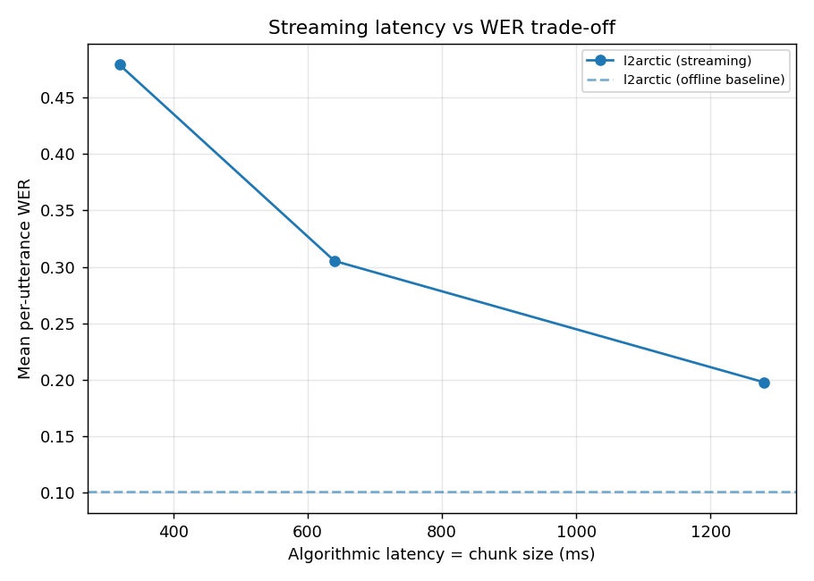
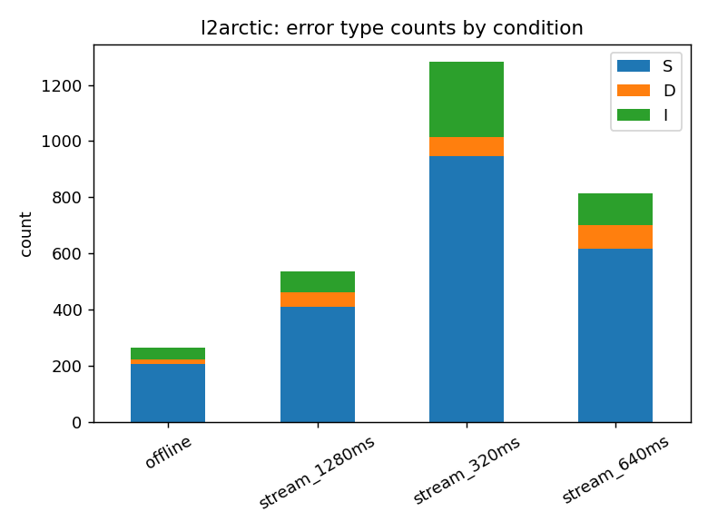

# Phase A report — l2arctic

> **PRELIMINARY.** Error-type proportions below are automatic substitution/
> deletion/insertion counts only. The accent vs disfluency vs VAD-cutoff vs
> hallucination breakdown requires the manual annotation pass on the error CSV.

## Hardware / run config
- Model: `small.en`  | compute: `int8` | device: `auto`
- Chunk sizes (ms): [640, 1280]  | left context: 2000 ms
- Utterances/condition cap: 150

## Per-condition WER / CER / latency
(`mean_wer`/`mean_cer` are means of per-utterance scores; `mean_rtf` is mean
real-time factor; `alat_ms` is the algorithmic latency = chunk size.)

| condition | n | mean_wer | mean_cer | mean_rtf | mean_proc_s | alat_ms |
| --- | --- | --- | --- | --- | --- | --- |
| offline | 300 | 0.101 | 0.053 | 0.059 | 0.186 | nan |
| stream_320ms | 300 | 0.479 | 0.309 | 0.582 | 2.072 | 320.000 |
| stream_640ms | 300 | 0.305 | 0.196 | 0.314 | 1.110 | 640.000 |
| stream_1280ms | 300 | 0.198 | 0.121 | 0.169 | 0.592 | 1280.000 |

## Latency vs WER trade-off

## Error-type mix (PRELIMINARY, auto S/D/I)

Totals across all conditions:
- **substitutions**: 2179 (75.3%)
- **deletions**: 221 (7.6%)
- **insertions**: 495 (17.1%)

Error CSV: `phaseA_error_annotation_offline.csv` — 264 rows, 0 manually annotated with a why-category (0% done).

## What is automated vs. manual here
- **Automated:** all numbers and plots above (S/D/I counts, WER/CER, latency).
- **Manual (yours):** open the error CSV and fill `why_category` per error.
  Phase B's category-level deltas only become meaningful after that pass.
