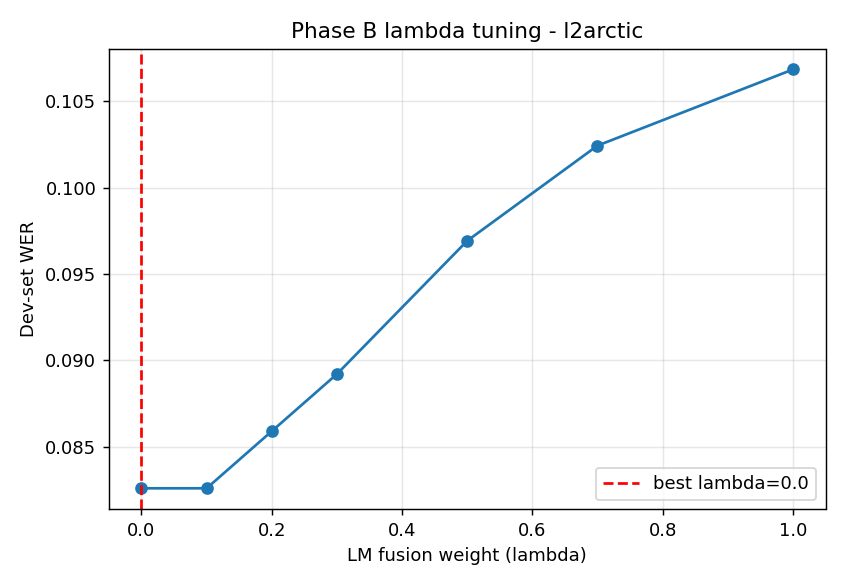
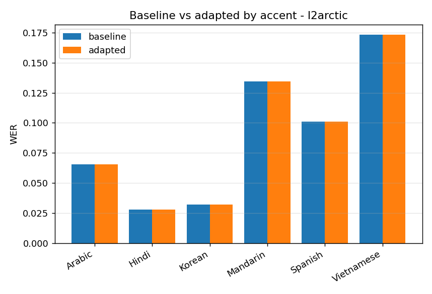

# Phase B report - l2arctic

Audio-free domain adaptation via n-best rescoring on the **frozen** Whisper
decoder (no audio fine-tuning). LM: `models/lm/l2arctic_4gram.pkl`, n-best=10.

## Setup
- Eval clips: 300  (dev 102 for lambda tuning / test 198 for reporting)
- lambda grid: [0.0, 0.1, 0.2, 0.3, 0.5, 0.7, 1.0]  ->  **best lambda = 0.0** (chosen on dev)
- Hypotheses changed by rescoring on test: 0

## Overall result (TEST split) - adaptation **no improvement**
| | WER |
|---|---|
| baseline (Whisper top-1) | 0.0878 |
| adapted (LM rescored) | 0.0878 |
| absolute delta | 0.0000 |
| relative | 0.0% |

## Stratified by accent / L1 (honest sub-group check)
Negative delta = improvement; positive = hurt. Watch for adaptation that helps
some groups and hurts others.

| accent | n | WER baseline | WER adapted | delta |
|---|---|---|---|---|
| Arabic | 44 | 0.0657 | 0.0657 | 0.0000 |
| Hindi | 34 | 0.0278 | 0.0278 | 0.0000 |
| Korean | 31 | 0.0323 | 0.0323 | 0.0000 |
| Mandarin | 33 | 0.1344 | 0.1344 | 0.0000 |
| Spanish | 26 | 0.1008 | 0.1008 | 0.0000 |
| Vietnamese | 30 | 0.1731 | 0.1731 | 0.0000 |

## Pending: category-level delta
The before/after split by ERROR CATEGORY (accent_phoneme / disfluency / vad /
hallucination) requires your manual annotation pass (ANNOTATION.md) joined with
these results. Once the error CSV is annotated, that breakdown can be added -
it's the key question of *which kind* of error the LM fixes.
