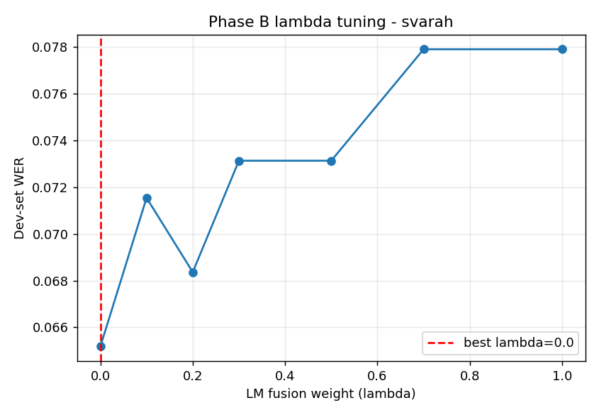
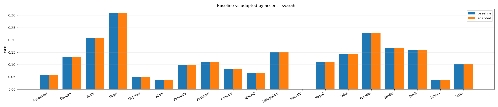

# Phase B report - svarah

Audio-free domain adaptation via n-best rescoring on the **frozen** Whisper
decoder (no audio fine-tuning). LM: `models/lm/svarah_4gram.pkl`, n-best=10.

## Setup
- Eval clips: 150  (dev 51 for lambda tuning / test 99 for reporting)
- lambda grid: [0.0, 0.1, 0.2, 0.3, 0.5, 0.7, 1.0]  ->  **best lambda = 0.0** (chosen on dev)
- Hypotheses changed by rescoring on test: 0

## Overall result (TEST split) - adaptation **no improvement**
| | WER |
|---|---|
| baseline (Whisper top-1) | 0.0998 |
| adapted (LM rescored) | 0.0998 |
| absolute delta | 0.0000 |
| relative | 0.0% |

## Stratified by accent / L1 (honest sub-group check)
Negative delta = improvement; positive = hurt. Watch for adaptation that helps
some groups and hurts others.

| accent | n | WER baseline | WER adapted | delta |
|---|---|---|---|---|
| Assamese | 6 | 0.0571 | 0.0571 | 0.0000 |
| Bengali | 3 | 0.1304 | 0.1304 | 0.0000 |
| Bodo | 6 | 0.2083 | 0.2083 | 0.0000 |
| Dogri | 3 | 0.3103 | 0.3103 | 0.0000 |
| Gujarati | 10 | 0.0504 | 0.0504 | 0.0000 |
| Hindi | 8 | 0.0385 | 0.0385 | 0.0000 |
| Kannada | 12 | 0.0976 | 0.0976 | 0.0000 |
| Kashmiri | 1 | 0.1111 | 0.1111 | 0.0000 |
| Konkani | 7 | 0.0833 | 0.0833 | 0.0000 |
| Maithili | 3 | 0.0652 | 0.0652 | 0.0000 |
| Malayalam | 5 | 0.1522 | 0.1522 | 0.0000 |
| Marathi | 2 | 0.0000 | 0.0000 | None |
| Nepali | 7 | 0.1089 | 0.1089 | 0.0000 |
| Odia | 5 | 0.1429 | 0.1429 | 0.0000 |
| Punjabi | 4 | 0.2273 | 0.2273 | 0.0000 |
| Sindhi | 2 | 0.1667 | 0.1667 | 0.0000 |
| Tamil | 3 | 0.1600 | 0.1600 | 0.0000 |
| Telugu | 6 | 0.0370 | 0.0370 | 0.0000 |
| Urdu | 6 | 0.1034 | 0.1034 | 0.0000 |

## Pending: category-level delta
The before/after split by ERROR CATEGORY (accent_phoneme / disfluency / vad /
hallucination) requires your manual annotation pass (ANNOTATION.md) joined with
these results. Once the error CSV is annotated, that breakdown can be added -
it's the key question of *which kind* of error the LM fixes.
